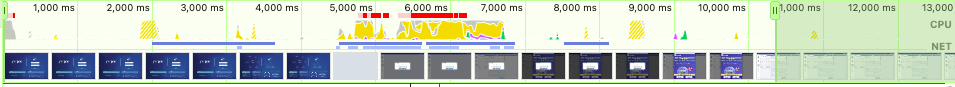
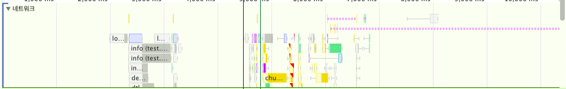
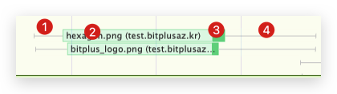
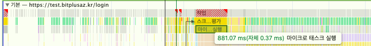
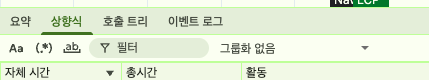
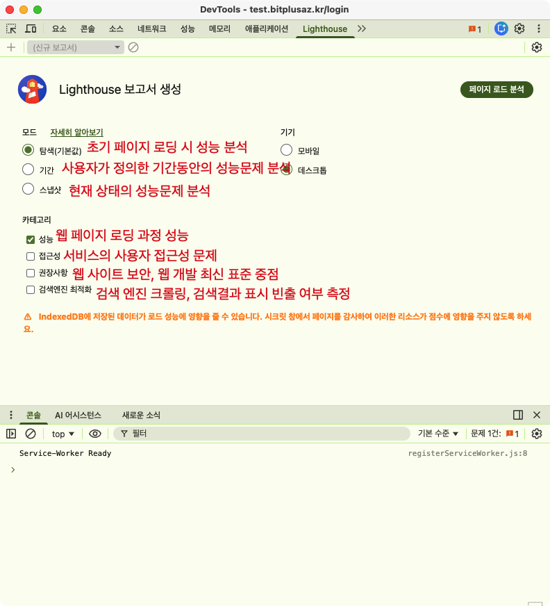
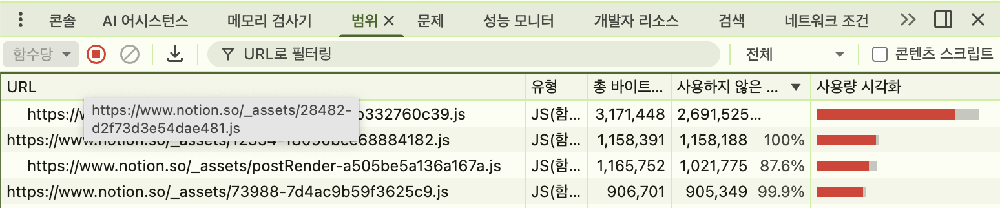

# 크롬 개발자 도구 사용하기(상단)

## 성능(Performance)
1. CPU 차트

    - 파란색 : HTML 요청
    - 노란색 : js 실행 작업
    - 보라색 : 렌더링, 레이아웃 작업
    - 초록색 : 페인팅 작업
    - 회색 : 기타 시스템 작업
    - 빨간색 : 병목 발생 지점. 메인스레드 잡아두는 부분
2. Network 차트

    - 서비스 로드 과정에서의 네트워크 요청을 시간 처리 순서에 따라 표시
    - 위쪽, 진한 색일수록 우선순위가 높은 네트워크 리소스
    
    1. 왼쪽 회색 선 : 초기 연결 시간
    2. 막대의 옅은 색 영역 : 요청을 보낸 시점부터 응답을 기다리는 시점까지의 시간(TTFB)
    3. 막대의 짙은 색 영역 : 콘텐츠 다운로드 시간
    4. 오른쪽 회색 선 : 해당 요청에 대한 메인 스레드의 작업 시간

3. 프레임 
화면에 변화가 있을 때마다 스크린샷

4. 기본 (Main)
브라우저의 메인 스레드에서 실행되는 작업을 플레임 차트(Flame chart)로 표시. 어떤 작업이 병목인지 확인 가능

    > [!TIP] 
    > **Flame chart**  
    > x축은 시간의 흐름, y축은 스택의 깊이를 나타내고  
    > 막대가 아래쪽일수록 상위작업, 위쪽으로 하위 작업을 나타내는 차트  
    > 다만 개발자도구의 해당 섹션에서는 상하가 뒤집힌 형태를 사용함  

5. 기타 탭

    - 요약(Summary) : 선택 영역에서 발생한 작업 시간의 총합과 각 작업이 차지하는 비중 표현
    - 상향식(Bottom-up) : 가장 최하위에 있는 작업부터 상위 작업까지 역순으로 보여줌
    - 호출 트리(Call Tree) : 상향식 반대
    - 이벤트 로그(Event Log) : 발생한 이벤트 

## Light house
 - **FCP(Fist Contenful Paint**, 가중치 10%) : 브라우저가 DOM 콘텐츠의 첫 부분을 렌더링하는데 걸리는 시간에 관한 지표
 - **SI(Speed Index**, 가중치 10%) : 페이지 로드 중 콘텐츠가 시각적으로 표시되는 속도
 - **LCP(Largest Contentful Paint**, 가중치 25%) : 화면의 가장 큰 이미지나 텍스트 요소가 렌더링되기까지 걸리는 시간
 - **TTI(Time to Interactive**, 가중치 10%) : 사용자가 페이지와 상호 작용이 가능한 시점까지 걸리는 시간
 - **TBT(Total Blocking Time**, 가중치 30%) : 페이지가 사용자 입력을 차단한 시간을 총합한 지표 
 - **CLS(Cumulative Layout Shift**, 가중치 15%) : 페이지 로드 과정에서의 예기치 못한 레이아웃 이동 측정
 - 하단 추가 정보 표시 : 웹 페이지의 문제점, 해결방안, 개선 시 이점 등 표시
    - Oppertunities : 로딩속도 개선사항 제안
    - Diagnostics : 성능과 관련된 기타 정보 제안 
    - 검사환경정보 표시 : Emulated Desktop, Custom throttling등...
    cpu성능 제한을 어느정도로 두고 검사했는지 확인 가능. 모바일은 4x정도로 더 제한을 많이두고 검사함

### Navigation

---

# 개발자모드 하단
## coverage (범위)

- 웹 페이지 렌더링 중 실행된 코드
- 각 파일에서 코드가 실행된 비율 : 적을수록 불필요한 코드가 많이 포함됨
- 